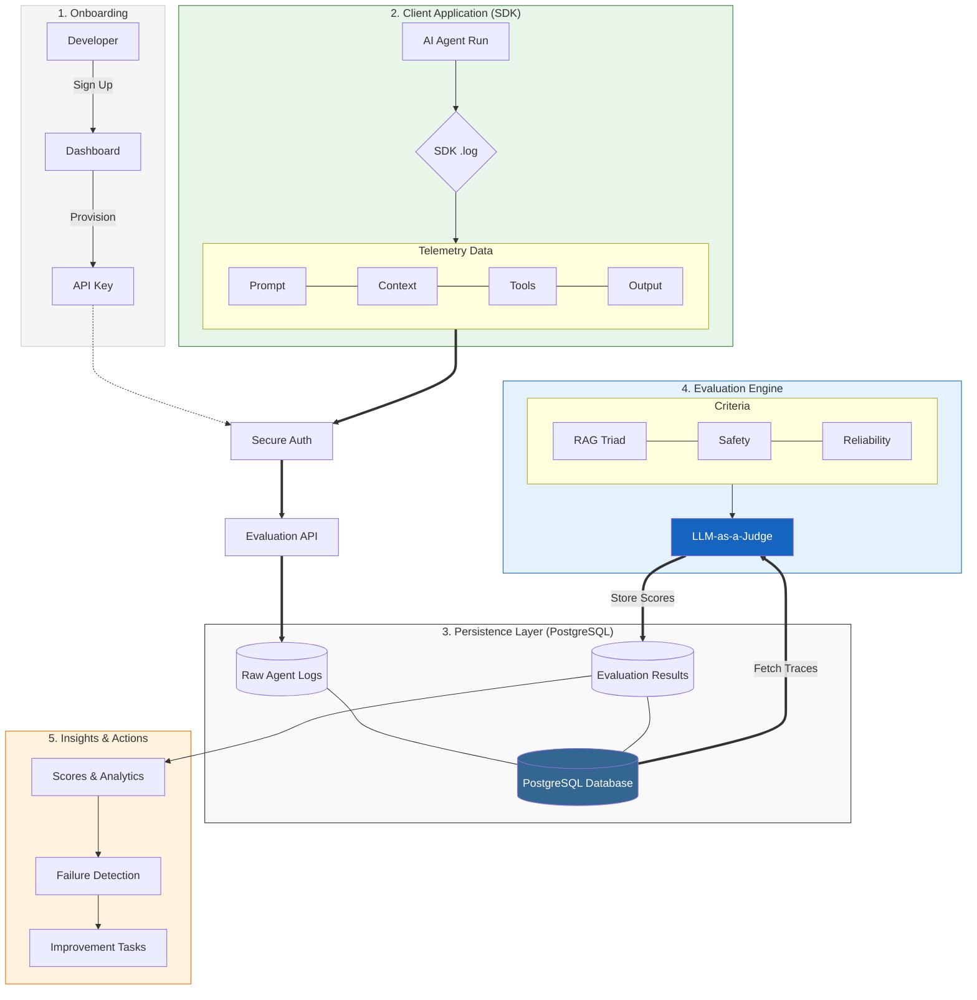

# AI Agent Evaluation System (MVP)
*A tool designed to measure the output quality and reliability of AI Agents*

## Overview
The System provides developers insights into the accuracy, reliability, and consistency of AI content by evaluating agents and their underlying models against strict, predefined metrics.

Key features:
* Measures the accuracy and relevance of agent outputs using standardized evaluation frameworks.
* Evaluates multi-step reasoning and tool usage to ensure agents follow correct decision-making processes.
* Monitors data drift to track how performance changes over time as new data or behaviors is introduced.
* Provides clear explanations for why an output scored high or low.
* Automatically identifies failures and generates targeted improvement tasks for prompts, tools, or configurations.

## Getting Started
In progress 🚧 

~~Integrating the evaluation system into your AI application takes just a few steps:~~

~~1. Sign up and create an account~~  
~~2. Get your API key from the dashboard~~  
~~3. Install the SDK in your application~~  
~~4. Log your agent runs with a single function call~~

~~Then, your application sends run data directly to the evaluation API via a simple push integration.~~

*~~See the Demo section below to watch how the integration works.~~*

## Demo
In progress 🚧
<!-- Todo:  -->

## System Architecture

## AI Output Evaluation Metrics

The system evaluates AI agent and model performance across three core pillars:

### 1. Content Quality (The RAG Triad)
* Checks if the answer is fully supported by the retrieved context to minimize hallucinations.
* Measures how directly and completely the output addresses the specific user query.
* Evaluates whether the sources retrieved by the system are truly relevant to the query.

### 2. Agent Reliability
* Verifies if the agent selects the correct tool and formats the arguments properly based on the context.
* Assesses how well the output matches known facts.
* Measures consistency of outputs across repeated runs with the same input.
* Tracks stability of outputs over time to detect semantic drift in agent behavior or underlying data.

### 3. Safety & Risk Mitigation
* Detects harmful content, bias, or toxic (unsafe) language within the agent's reasoning or final output.
* Checks for accidental exposure of sensitive or personally identifiable information (PII).
* Ensures outputs comply with safety constraints and policy rules.

## Installation
Planned 📌 
<!-- TODO: Setup instructions -->

## Future Work
* Expansion of this project into a full AI Observation Platform, supporting not only LLMs and AI agents, but also other modalities such as Computer Vision and Speech Processing.
* Integration of an event-driven logging pipeline

---
*Developed to make AI content trustworthy and measurable*
